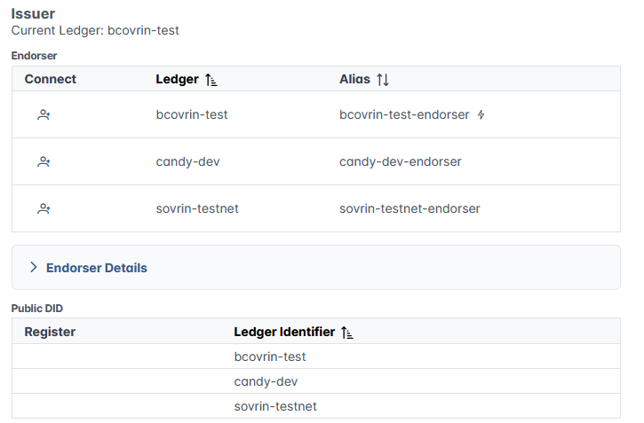

# Becoming an Issuer

Becoming an issuer in Traction will provide you with the ability of "rooting" your agent on a ledger in write mode, and start publishing schemas and credential definitions, and therefore issue your own credentials.

Becoming an issuer involves accepting the Governance built around Digital credentials, and obtaining approval for publishing new schemas/credential definitions. This conversation can be initiated with the Digital trust team when requesting a new tenant or any time afterwards.
For Governance questions, please refer to https://github.com/bcgov/bc-vcpedia .

Once approval is obtained, it will be possible to select which ledger to connect to in write mode from the `Profile` section of your tenant.

## Endorsers

When becoming an issuer, the agent will be connected with the role of `author` to an `endorser` who is responsible for "supporting" write transactions from authors.

Endorsement requests are reviewed by the Digital Trust team and acted upon based on the published Governance. The Digital trust team may request adjustments in naming or other schema/credential definition settings in order to approve an endorsement request.

!!! info "Note"
    It is generally allowed to publish new schemas and credential definitions in the development environment. Test and Production are gated behind an endorser that respects the published Governance.